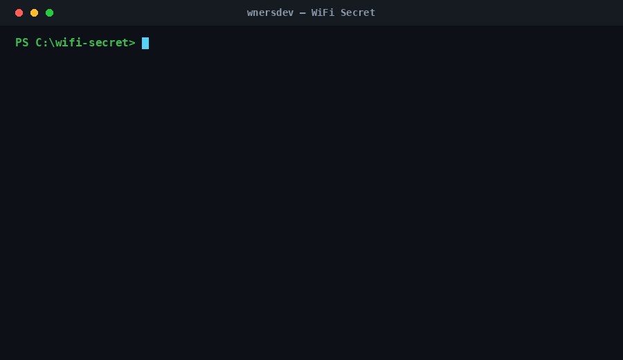
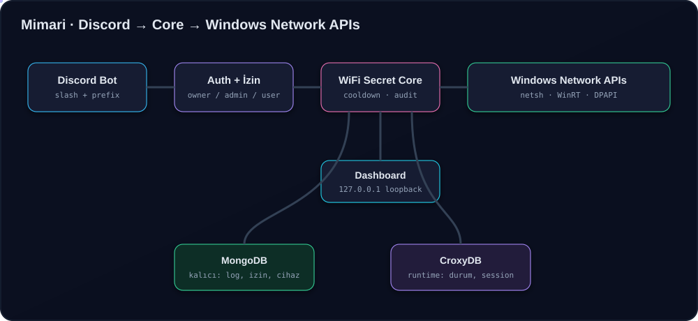

<div align="center">



<br/>


<br/><br/>


</div>


## 🎬 Demo

<div align="center">

<br/>
<sub><i>Yukarıdaki demo komut satırı çıktısını canlandırır. Gerçek değerler kendi makinenizdeki ağa göre gelir.</i></sub>
</div>


## ✨ Özellikler

| | Modül | Ne yapar |
|:--:|:--|:--|
| 📡 | **Wi-Fi Analiz** | Mevcut bağlantı, SSID/BSSID, sinyal (%/dBm), kanal, bant (2.4/5/6 GHz), güvenlik, adapter, IP/Gateway/DNS/MAC, internet testi |
| 🔎 | **Ağ Tarama** | Çevredeki ağlar, kanal yoğunluğu haritası, en boş kanal önerisi |
| 🛡️ | **Güvenlik Taraması** | Kendi ağınız için A–F puanı: WPA/WPA2/WPA3/WEP/Open, zayıf sinyal, kanal sıkışıklığı, DNS/Gateway |
| 📶 | **Hotspot Engine** | Windows WinRT tethering — başlat / durdur / yeniden başlat / durum / bağlı cihazlar (IP + MAC) |
| 💾 | **Profil Yedekleme** | Kendi Wi-Fi profillerini listele / incele / **AES-256-GCM şifreli** yedekle / doğrula / geri yükle / sil |
| 🔑 | **Parola Üretici** | Kriptografik güçlü parola, uzunluk + karakter seçimi, güç ölçer |
| 🔳 | **Wi-Fi QR** | `WIFI:` formatında QR — SSID/parola/güvenlik ile bağlanılabilir kod |
| 🌍 | **IP → Bölge** | Yaklaşık (yalnızca bölgesel) IP geolocation: ülke/şehir/ISP/ASN/timezone |
| 🤖 | **Discord Bot** | Slash + prefix, owner/admin/user izinleri, cooldown, audit log, embed/buton, kritik komut onayı |
| 🧪 | **Lab (Fake WiFi)** | Yalnızca kendi makinenizde **izole test hotspot'u** — taklit/parola toplama/MITM YOK |


## 🧭 Mimari

<div align="center">

</div>

> **Discord Bot → Auth + İzin → WiFi Secret Core → Windows Network APIs.**
> Bot doğrudan işletim sistemi komutu çalıştırmaz; yalnızca Core'daki tanımlı işlemleri çağırır.
> Secret'lar **DPAPI** ile şifreli (`.env` yok), dashboard yalnızca **loopback** dinler.


## 🚀 Kurulum

```bash
# 1) Bağımlılıklar
npm install

# 2) Secret'ları DPAPI ile güvenli kaydet (.env YOK)
npm run set-credential discord_token
npm run set-credential discord_client_id
npm run set-credential mongo_uri

# 3) Discord slash komutlarını kaydet
npm run register

# 4) Çalıştır
npm start        # dashboard (http://127.0.0.1:4790) + Discord bot
npm run ui       # sadece dashboard
npm run bot      # sadece bot
```

> `config/discord.json` içindeki `owners` / `admins` dizilerine kendi Discord ID'nizi ekleyin.


## 💻 Komut Satırı

```bash
node wnersdev.js cli status          # mevcut bağlantı
node wnersdev.js cli scan            # kanal yoğunluğu + öneri
node wnersdev.js cli security        # güvenlik puanı
node wnersdev.js cli hotspot start   # hotspot başlat
node wnersdev.js cli hotspot devices # bağlı cihazlar
node wnersdev.js cli ip 8.8.8.8      # IP → bölge
node wnersdev.js cli password 20     # parola üret
```


## 🤖 Discord Komutları

<table>
<tr><th>Slash</th><th>Prefix</th><th>Yetki</th></tr>
<tr><td><code>/wifi status</code></td><td><code>!wifi status</code></td><td>user</td></tr>
<tr><td><code>/wifi networks</code></td><td><code>!wifi networks</code></td><td>user</td></tr>
<tr><td><code>/wifi scan</code></td><td><code>!wifi scan</code></td><td>user</td></tr>
<tr><td><code>/wifi security</code></td><td><code>!wifi security</code></td><td>user</td></tr>
<tr><td><code>/wifi qr</code> · <code>/wifi password</code> · <code>/wifi ip</code></td><td>—</td><td>user</td></tr>
<tr><td><code>/wifi hotspot info</code></td><td><code>!wifi hotspot info</code></td><td>user</td></tr>
<tr><td><code>/wifi hotspot start·stop·restart</code></td><td><code>!wifi hotspot start·stop</code></td><td>admin 🔒</td></tr>
<tr><td><code>/wifi devices</code> · <code>/wifi logs</code> · <code>/wifi backup</code></td><td>—</td><td>admin</td></tr>
<tr><td><code>/wifi restore</code></td><td>—</td><td>owner 🔒</td></tr>
</table>

🔒 = onay butonu ister. Her komutta cooldown + audit log çalışır.


## 🔐 Güvenlik

- 🚫 **`.env` yok** — Discord token / Mongo URI Windows **DPAPI** (CurrentUser) ile şifreli, kaynak kodda hard-code yok.
- 🔒 **Dashboard** yalnızca `127.0.0.1` dinler, ağa açılmaz.
- 🧊 **Yedekler** AES-256-GCM + scrypt, sizin belirlediğiniz parolayla (`data/backups/*.wsb`).
- 🙈 Loglarda parola/anahtar **maskelenir**.
- 🧪 **Lab / Fake WiFi** yalnızca izole test hotspot'u; SSID taklidi, captive portal, credential harvesting, MITM **yoktur**.


<details>
<summary>📁 <b>Dosya Yapısı</b></summary>

```
wnersdev.js              giriş noktası (dashboard + bot + cli)
src/core/                wifi · hotspot · scanner · security
src/services/            password · qr · geo · backup · audit
src/database/            mongo (10 model) + croxy (runtime)
src/discord/             bot · commands · permissions · cooldown · embeds
src/server/              loopback dashboard API
public/                  dark dashboard (index.html + app.js)
config/                  config.json · database.json · discord.json
scripts/                 set-credential · register-commands
```
</details>

<div align="center">
<br/>

<sub>Made with 💙 by <b>wnersdev</b> · <code>#powerbywnersdev</code></sub>
</div>
